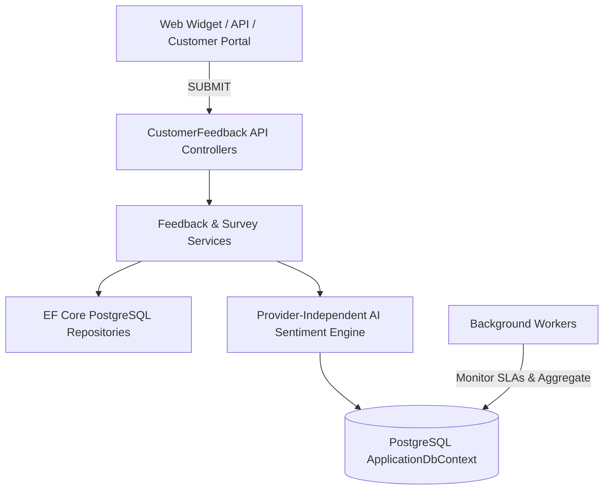

# Customer Feedback Platform & Survey Engine

## Business Value Rule (MANDATORY ADHERENCE)
The BusinessOS AI Customer Feedback module is engineered specifically around measurable business ROI:
1. **Save Business Owners Time**: Automatically categorizes and routes general feedback, rating reviews, and survey submissions without manual agent sorting or triage.
2. **Increase Revenue**: Identifies brand promoters and triggers VIP partner referral incentives while saving accounts from imminent cancellation churn.
3. **Reduce Operational Costs**: Automates follow-ups and export reporting (CSV), eliminating repetitive administrative work and SLA delays.
4. **Improve Business Decision-Making**: Provides real-time sentiment breakdowns, recurring root cause complaint clusters, and actionable executive trends.

---

## Architectural Overview

The platform is designed around Clean Architecture and CQRS principles with multi-tenant tenant isolation (`OrganizationId`), asynchronous Redis caching readiness, and background workers in ASP.NET Core (.NET 9).

### Core Sub-Modules
* **Feedback Engine**: Universal submission point for customer complaints, inquiries, and praise. Supports pagination, complex filtering, and instant CSV export.
* **Ratings & Reviews**: Flexible star rating captures (1-10 scale or 1-5 scale) across products, support agents, services, and transactions with instant star distribution summaries.
* **Surveys Platform**: Campaign management for Net Promoter Score (NPS), Customer Satisfaction (CSAT), and Customer Effort Score (CES) with automated scoring and completion rate calculations.

---

## REST API Endpoints Summary

| Endpoint | Method | Purpose |
| :--- | :--- | :--- |
| `/api/v1/customer-feedback/submit` | `POST` | Submit universal customer feedback (anonymous widget supported) |
| `/api/v1/customer-feedback/{id}` | `GET` | View feedback detail with attached AI sentiment classification |
| `/api/v1/customer-feedback/search` | `GET` | Search feedbacks by rating, status, date, and keyword query |
| `/api/v1/customer-feedback/export` | `GET` | Instant high-speed CSV download of organization feedback |
| `/api/v1/ratings` | `POST` | Record verified purchase star rating with optional review text |
| `/api/v1/ratings/summary/{type}/{id}`| `GET` | Obtain aggregated average star ratings & breakdown distributions |
| `/api/v1/surveys` | `POST` | Launch new CSAT/NPS survey campaign with tailored questions |
| `/api/v1/surveys/{id}/respond` | `POST` | Submit customer survey answers with automated sentiment analysis |
