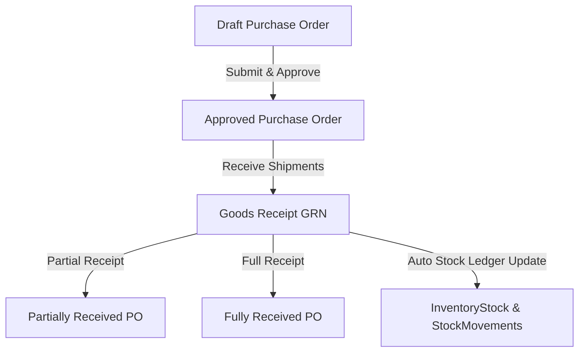

# Purchase Order Management & Goods Receiving

## Overview
The Purchasing Subsystem automates purchase order creation, approval workflows, goods receipts, partial fulfillment handling, and seamless inventory stock ledger updates.

## Workflow Pipeline

### 1. Purchase Order Lifecycle
- **Statuses**: `Draft`, `Submitted`, `Approved`, `PartiallyReceived`, `FullyReceived`, `Cancelled`.
- **Financial Breakdown**: Automatic calculations for line items subtotal, configurable tax, shipping cost, and grand total.

### 2. Goods Receipt Note (GRN) Processing
- Physical goods receipt creates a `GoodsReceipt` record linked to the PO.
- Line-item breakdown supports accepted vs rejected quantities with rejection reasons.
- Accepted items automatically increment target warehouse `QuantityOnHand` and write an immutable `PurchaseReceipt` stock movement entry.
- Dynamically updates PO status based on total received vs ordered line items.

### 3. API Endpoints
- `GET /api/purchasing/orders`: List purchase orders with filters.
- `POST /api/purchasing/orders`: Create new Purchase Order.
- `PUT /api/purchasing/orders/{id}`: Update draft Purchase Order.
- `POST /api/purchasing/orders/{id}/approve`: Approve Purchase Order.
- `POST /api/purchasing/receipts`: Create Goods Receipt (GRN) & update inventory stock.
- `GET /api/purchasing/receipts`: Fetch Goods Receipt history.
